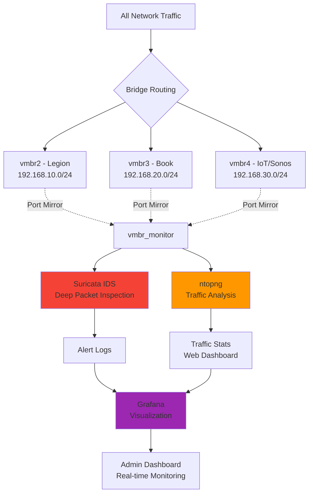
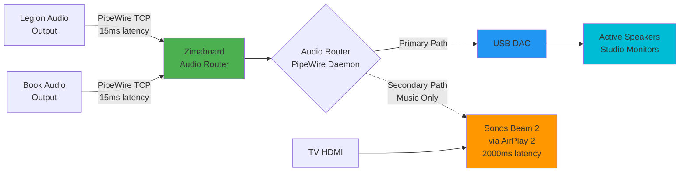
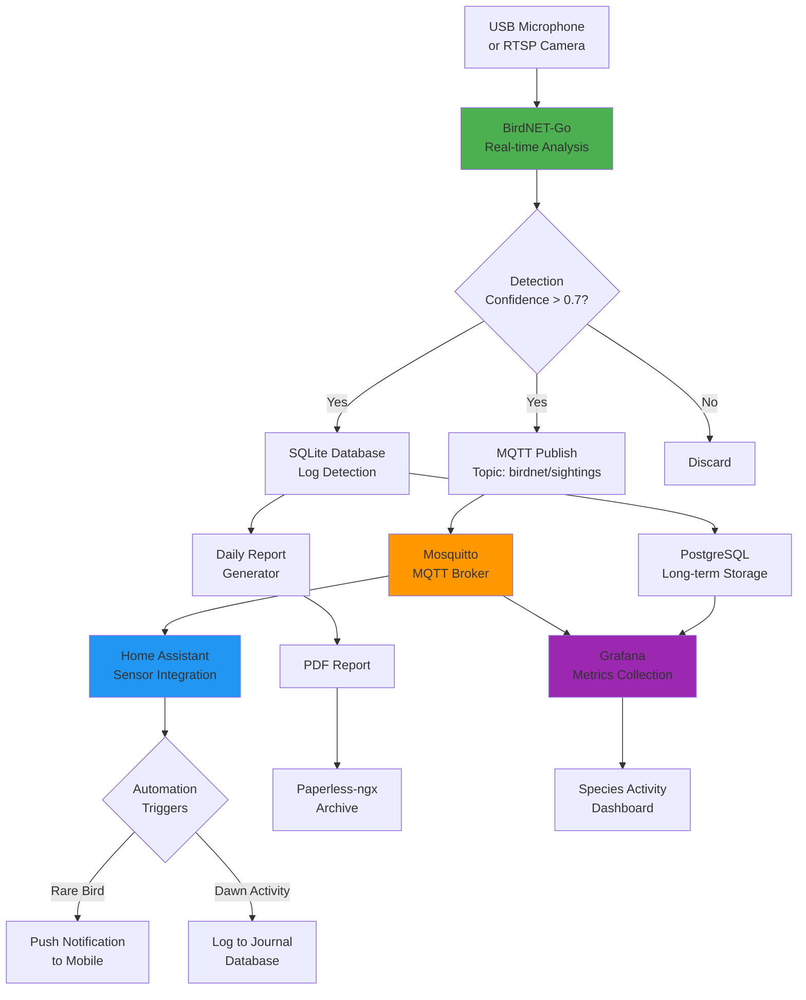
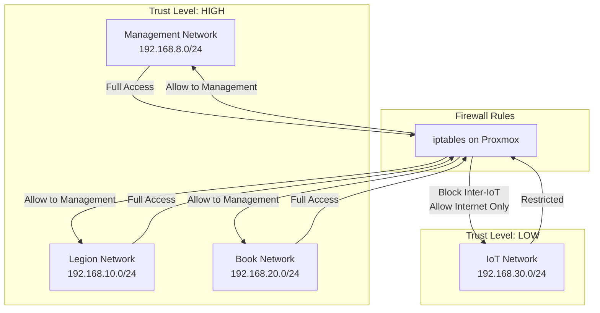
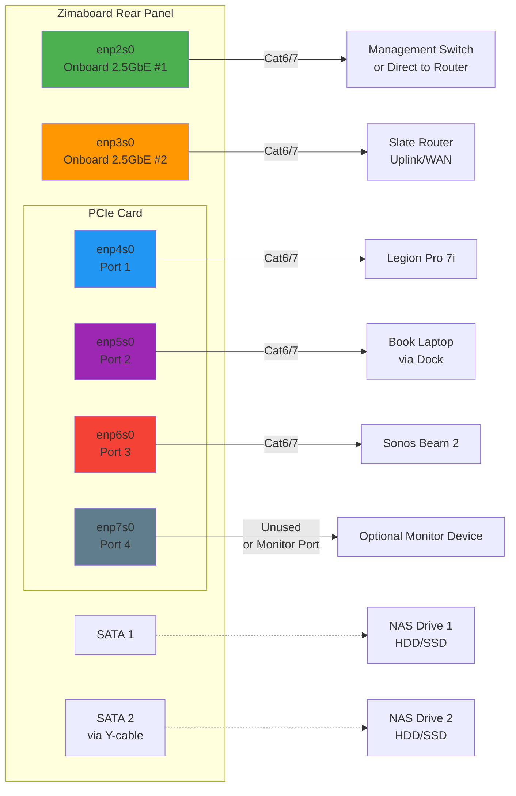

# Zimaboard HomeLab Network Topology

## Complete Network Architecture

```mermaid
graph TB
    subgraph Internet
        ISP[Internet Service Provider]
    end

    subgraph "External Network"
        Router[Slate Router<br/>192.168.8.1]
    end

    subgraph "Zimaboard Physical Hardware"
        direction TB
        CPU[Intel N3450<br/>Quad-core 2.7GHz]
        RAM[16GB LPDDR4]
        SATA1[SATA Port 1<br/>NAS Drive 1]
        SATA2[SATA Port 2<br/>NAS Drive 2]

        subgraph "Network Interfaces"
            NIC1[Onboard NIC 1<br/>enp2s0<br/>2.5GbE]
            NIC2[Onboard NIC 2<br/>enp3s0<br/>2.5GbE]
            PCIe[PCIe 4x 2.5GbE Card]
            PCIE1[enp4s0 - 2.5GbE]
            PCIE2[enp5s0 - 2.5GbE]
            PCIE3[enp6s0 - 2.5GbE]
            PCIE4[enp7s0 - 2.5GbE]
        end
    end

    subgraph "Proxmox VE Host Layer"
        direction TB
        PVE[Proxmox VE 8.x<br/>192.168.8.21]

        subgraph "Linux Bridges"
            VMBR0[vmbr0 - Management<br/>192.168.8.21/24<br/>Bridge: enp2s0]
            VMBR1[vmbr1 - Uplink<br/>Bridge: enp3s0]
            VMBR2[vmbr2 - Legion Network<br/>192.168.10.1/24<br/>Bridge: enp4s0]
            VMBR3[vmbr3 - Book Network<br/>192.168.20.1/24<br/>Bridge: enp5s0]
            VMBR4[vmbr4 - IoT Network<br/>192.168.30.1/24<br/>Bridge: enp6s0]
            VMBR_MON[vmbr_monitor<br/>Traffic Mirror<br/>Bridge: enp7s0]
        end
    end

    subgraph "Storage Layer"
        direction LR
        BTRFS[BTRFS RAID1<br/>2x HDDs/SSDs<br/>Mirror Mode]
        ZFS_POOL[Optional ZFS Pool<br/>High RAM Usage]
    end

    subgraph "LXC Containers"
        direction TB

        subgraph "Network Services LXC"
            SURICATA[Suricata IDS<br/>4-6GB RAM<br/>IP: 192.168.8.30<br/>Monitors all bridges]
            NTOPNG[ntopng Monitor<br/>2-3GB RAM<br/>IP: 192.168.8.31<br/>Web UI: 3000]
            DESKFLOW[Deskflow KVM<br/>512MB RAM<br/>IP: 192.168.8.32<br/>Port: 24800]
            AUDIO_ROUTER[PipeWire Router<br/>512MB RAM<br/>IP: 192.168.8.33<br/>Port: 4656]
        end

        subgraph "Media Stack LXC"
            DOCKER_MEDIA[Docker Host - Media<br/>8-10GB RAM<br/>4 CPU cores<br/>IP: 192.168.8.40]

            subgraph "Media Containers"
                JELLYFIN[Jellyfin<br/>2GB RAM<br/>Port: 8096]
                SONARR[Sonarr<br/>512MB]
                RADARR[Radarr<br/>512MB]
                PROWLARR[Prowlarr<br/>256MB]
                QBIT[qBittorrent<br/>512MB + VPN]
                AUDIOBOOKSHELF[Audiobookshelf<br/>512MB<br/>Port: 13378]
                TUBEARCHIVIST[TubeArchivist<br/>3-4GB<br/>Port: 8000]
            end
        end

        subgraph "Knowledge Stack LXC"
            DOCKER_KNOWLEDGE[Docker Host - Knowledge<br/>4-6GB RAM<br/>2 CPU cores<br/>IP: 192.168.8.50]

            subgraph "Knowledge Containers"
                SILVERBULLET[Silverbullet<br/>256MB<br/>Port: 3000]
                PAPERLESS[Paperless-ngx<br/>2GB<br/>Port: 8000]
                POSTGRES[PostgreSQL<br/>512MB]
                REDIS[Redis<br/>256MB]
            end
        end

        subgraph "IoT & Automation LXC"
            DOCKER_IOT[Docker Host - IoT<br/>2-4GB RAM<br/>2 CPU cores<br/>IP: 192.168.8.60]

            subgraph "IoT Containers"
                HOMEASSISTANT[Home Assistant<br/>1-2GB<br/>Port: 8123]
                MOSQUITTO[Mosquitto MQTT<br/>128MB<br/>Port: 1883]
                BIRDNET[BirdNET-Go<br/>512MB<br/>Port: 8080]
                GRAFANA[Grafana<br/>512MB<br/>Port: 3000]
            end
        end

        NAS_LXC[OpenMediaVault LXC<br/>1GB RAM<br/>IP: 192.168.8.70<br/>Web UI: 80]
    end

    subgraph "Virtual Machines (Optional)"
        NESSUS_VM[Nessus VM<br/>4GB RAM<br/>2 CPU cores<br/>IP: 192.168.8.80<br/>Resource Limited]
        HAOS_VM[Home Assistant OS<br/>Alternative to Container<br/>4GB RAM<br/>IP: 192.168.8.81]
    end

    subgraph "Client Devices"
        LEGION[Lenovo Legion Pro 7i<br/>192.168.10.10<br/>High Performance<br/>Gaming/Work]
        BOOK[Laptop 'Book'<br/>192.168.20.10<br/>Mobile Workstation]
        SONOS[Sonos Beam 2<br/>192.168.30.10<br/>Audio Output<br/>HDMI eARC for TV]
    end

    subgraph "Audio Hardware"
        USB_DAC[USB DAC<br/>FiiO K5 Pro<br/>Connected to Zimaboard]
        SPEAKERS[Active Speakers<br/>Studio Monitors]
    end

    ISP --> Router
    Router -->|WAN| VMBR1
    VMBR1 -->|NAT/Masquerade| VMBR0

    NIC1 -.-> VMBR0
    NIC2 -.-> VMBR1
    PCIE1 -.-> VMBR2
    PCIE2 -.-> VMBR3
    PCIE3 -.-> VMBR4
    PCIE4 -.-> VMBR_MON

    VMBR0 --> PVE
    VMBR0 --> SURICATA
    VMBR0 --> NTOPNG
    VMBR0 --> DESKFLOW
    VMBR0 --> AUDIO_ROUTER
    VMBR0 --> DOCKER_MEDIA
    VMBR0 --> DOCKER_KNOWLEDGE
    VMBR0 --> DOCKER_IOT
    VMBR0 --> NAS_LXC
    VMBR0 --> NESSUS_VM

    VMBR2 -->|Client Network| LEGION
    VMBR3 -->|Client Network| BOOK
    VMBR4 -->|IoT Network| SONOS

    VMBR_MON -.->|Port Mirroring| SURICATA
    VMBR_MON -.->|Port Mirroring| NTOPNG

    SATA1 --> BTRFS
    SATA2 --> BTRFS
    BTRFS --> NAS_LXC
    BTRFS -.->|Bind Mount| DOCKER_MEDIA

    DOCKER_MEDIA --> JELLYFIN
    DOCKER_MEDIA --> SONARR
    DOCKER_MEDIA --> RADARR
    DOCKER_MEDIA --> PROWLARR
    DOCKER_MEDIA --> QBIT
    DOCKER_MEDIA --> AUDIOBOOKSHELF
    DOCKER_MEDIA --> TUBEARCHIVIST

    DOCKER_KNOWLEDGE --> SILVERBULLET
    DOCKER_KNOWLEDGE --> PAPERLESS
    DOCKER_KNOWLEDGE --> POSTGRES
    DOCKER_KNOWLEDGE --> REDIS

    DOCKER_IOT --> HOMEASSISTANT
    DOCKER_IOT --> MOSQUITTO
    DOCKER_IOT --> BIRDNET
    DOCKER_IOT --> GRAFANA

    LEGION -.->|Deskflow KVM| DESKFLOW
    BOOK -.->|Deskflow KVM| DESKFLOW

    LEGION -.->|PipeWire Audio<br/>10-20ms latency| AUDIO_ROUTER
    BOOK -.->|PipeWire Audio<br/>10-20ms latency| AUDIO_ROUTER
    AUDIO_ROUTER --> USB_DAC
    USB_DAC --> SPEAKERS

    SONOS -.->|AirPlay 2<br/>2000ms latency<br/>Music Only| AUDIO_ROUTER

    BIRDNET -.->|MQTT Messages| MOSQUITTO
    MOSQUITTO -.->|Sensor Data| HOMEASSISTANT
    BIRDNET -.->|SQLite DB| POSTGRES
    GRAFANA -.->|Queries| POSTGRES

    HOMEASSISTANT -.->|Control| SONOS

    classDef hardware fill:#e1f5ff,stroke:#01579b,stroke-width:2px
    classDef network fill:#f3e5f5,stroke:#4a148c,stroke-width:2px
    classDef storage fill:#fff3e0,stroke:#e65100,stroke-width:2px
    classDef container fill:#e8f5e9,stroke:#1b5e20,stroke-width:2px
    classDef vm fill:#fce4ec,stroke:#880e4f,stroke-width:2px
    classDef client fill:#fff9c4,stroke:#f57f17,stroke-width:2px

    class CPU,RAM,SATA1,SATA2,NIC1,NIC2,PCIe,PCIE1,PCIE2,PCIE3,PCIE4,USB_DAC,SPEAKERS hardware
    class VMBR0,VMBR1,VMBR2,VMBR3,VMBR4,VMBR_MON,Router network
    class BTRFS,ZFS_POOL storage
    class SURICATA,NTOPNG,DESKFLOW,AUDIO_ROUTER,DOCKER_MEDIA,DOCKER_KNOWLEDGE,DOCKER_IOT,NAS_LXC,JELLYFIN,SONARR,RADARR,QBIT,SILVERBULLET,PAPERLESS,HOMEASSISTANT,BIRDNET container
    class NESSUS_VM,HAOS_VM vm
    class LEGION,BOOK,SONOS client
```



## Simplified Data Flow Diagrams

### Media Acquisition & Consumption Flow

```mermaid
flowchart LR
    A[User Requests<br/>Content] --> B[Jellyseerr<br/>Request Manager]
    B --> C{Content Type?}

    C -->|TV Show| D[Sonarr]
    C -->|Movie| E[Radarr]
    C -->|Music| F[Lidarr]
    C -->|Book| G[Readarr]

    D --> H[Prowlarr<br/>Indexer Search]
    E --> H
    F --> H
    G --> H

    H --> I[qBittorrent<br/>+ VPN Tunnel]

    I --> J[Downloads<br/>/mnt/storage/downloads]

    J --> K{Import & Organize}

    K --> L[/mnt/storage/media/<br/>tv/movies/music/books]

    L --> M[Jellyfin<br/>Media Server]
    L --> N[Audiobookshelf<br/>Books/Podcasts]

    M --> O[Client Playback<br/>Legion/Book/Mobile]
    N --> O

    style I fill:#ffeb3b
    style M fill:#4caf50
    style O fill:#2196f3
```

### Network Monitoring & Security Flow



### Low-Latency Audio Routing Flow



### Bird Monitoring & Home Automation Flow



## Network Segment Details

| Segment | Bridge | Subnet | Purpose | Firewall Rules |
|---------|--------|--------|---------|----------------|
| Management | vmbr0 | 192.168.8.0/24 | Proxmox host, containers, VMs | Allow all internal, SSH restricted |
| Uplink | vmbr1 | DHCP from ISP | Internet gateway | NAT, masquerade enabled |
| Legion Network | vmbr2 | 192.168.10.0/24 | High-performance client | Allow all, QoS priority |
| Book Network | vmbr3 | 192.168.20.0/24 | Mobile workstation | Allow all, QoS priority |
| IoT Network | vmbr4 | 192.168.30.0/24 | Sonos, smart devices | **Isolated**, no LAN access |
| Monitor | vmbr_monitor | No IP | Traffic mirroring | Promiscuous mode, no routing |

## Port Mapping Reference

### Core Services

| Service | Port | Protocol | Access |
|---------|------|----------|--------|
| Proxmox Web UI | 8006 | HTTPS | Management network only |
| Suricata | N/A | - | Backend service |
| ntopng | 3000 | HTTP | Internal network |
| Deskflow Server | 24800 | TCP | Client networks |
| PipeWire Audio | 4656 | TCP | Client networks |

### Media Stack

| Service | Port | Protocol | Access |
|---------|------|----------|--------|
| Jellyfin | 8096 | HTTP | All networks |
| Sonarr | 8989 | HTTP | Management only |
| Radarr | 7878 | HTTP | Management only |
| Prowlarr | 9696 | HTTP | Management only |
| qBittorrent | 8080 | HTTP | Management only |
| Audiobookshelf | 13378 | HTTP | All networks |
| TubeArchivist | 8000 | HTTP | All networks |

### Knowledge Stack

| Service | Port | Protocol | Access |
|---------|------|----------|--------|
| Silverbullet | 3000 | HTTP | All networks |
| Paperless-ngx | 8000 | HTTP | All networks |

### IoT & Automation

| Service | Port | Protocol | Access |
|---------|------|----------|--------|
| Home Assistant | 8123 | HTTP | All networks |
| Mosquitto MQTT | 1883 | TCP | Internal containers |
| BirdNET-Go | 8080 | HTTP | Management network |
| Grafana | 3000 | HTTP | All networks |

## Traffic Flow Priorities (QoS)

1. **Highest Priority (DSCP EF - Expedited Forwarding)**
   - Deskflow KVM traffic (ports 24800)
   - PipeWire audio streams (port 4656)
   - Real-time audio (RTP/RTSP)

2. **High Priority (DSCP AF41)**
   - Home Assistant automation
   - MQTT messages
   - SSH connections

3. **Medium Priority (DSCP AF21)**
   - Jellyfin streaming
   - Web browsing
   - API requests

4. **Low Priority (DSCP CS1)**
   - Torrent downloads (qBittorrent)
   - Backup operations
   - Bulk file transfers

## Security Zones



### Firewall Policy Summary

**IoT Network (vmbr4) Restrictions:**
- ✅ Allow outbound to Internet (DNS, NTP, cloud services)
- ✅ Allow inbound from Management network (for control)
- ❌ Block access to other client networks (Legion, Book)
- ❌ Block access to storage/NAS
- ❌ Block lateral movement within IoT network

**Implementation:**
```bash
# Implemented in /etc/network/interfaces
# See PROXMOX-NETWORK-CONFIG.sh for full iptables rules
```

## Bandwidth Allocation

Based on 2.5GbE interfaces (2500 Mbps theoretical):

| Service Category | Allocated Bandwidth | Notes |
|------------------|---------------------|-------|
| Client-to-Storage (NAS) | Up to 2000 Mbps | Limited by SATA SSD speed (~200 MB/s) |
| Jellyfin Streaming | 100 Mbps per stream | 4K = 80 Mbps, 1080p = 20 Mbps |
| Torrent Downloads | 500 Mbps (capped) | QoS ensures doesn't saturate |
| PipeWire Audio | 12 Mbps per stream | Uncompressed 48kHz/16bit stereo |
| Deskflow KVM | <1 Mbps | Very low bandwidth |
| MQTT/Home Assistant | <1 Mbps | Minimal bandwidth |
| Backups | Up to 1000 Mbps | Off-peak hours only |

## Physical Cabling Diagram



## Recommended Cable Labels

| Port | Label | Color Code |
|------|-------|------------|
| enp2s0 | "MGMT - To Switch" | Green |
| enp3s0 | "WAN - To Router" | Orange |
| enp4s0 | "Legion - 192.168.10.x" | Blue |
| enp5s0 | "Book - 192.168.20.x" | Purple |
| enp6s0 | "IoT - 192.168.30.x" | Red |
| enp7s0 | "Monitor - Mirror" | Gray |

---

**Legend:**
- Solid lines (→): Physical/data connections
- Dashed lines (-.->): Logical/virtual connections
- Boxes: Physical or virtual components
- Subgraphs: Logical groupings
